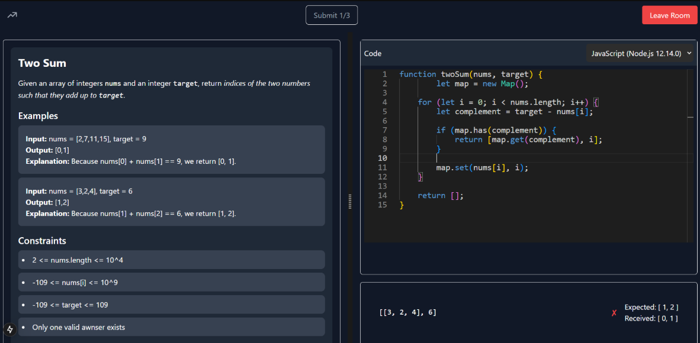

# 🚀 Live Coding Platform

Real-time collaborative coding environment built with Typescript, WebSockets, Judge0 API, and PostgreSQL.

 

📌 Overview
This platform allows multiple users to solve coding problems together in real-time. Built for mock interviews and coding practice, it features live code execution, synchronized sessions, and a shared problem-solving environment.

🛠️ Tech Stack: TypeScript, Node.js, Express, PostgreSQL, WebSockets, Judge0 API

💡 Features
🔄 Real-time Collaboration: Edit and run code simultaneously across multiple users using WebSocket communication.

💻 Multi-language Support: Compile code in various programming languages via Judge0 API.

🧠 Interview Questions: Practice LeetCode-style challenges with friends.

🧪 Used in live mock interviews with consistent low-latency performance.

🏆 Leaderboard System: Tracks user sessions and scores to encourage engagement.

<h3>⚙️ Tech Highlights</h3>
<ul>
  <li><strong>Backend:</strong> Node.js + Express + WebSocket</li>
  <li><strong>Frontend:</strong> React + TypeScript</li>
  <li><strong>Database:</strong> PostgreSQL + Sequelize</li>
  <li><strong>Code Execution:</strong> Judge0 API</li>
</ul>

<h3>🛠️ How It Works</h3>
<ul>
  <li><strong>User joins a room:</strong> Sessions are synced by WebSockets.</li>
  <li>Code is shared and updated in real-time.</li>
  <li><strong>Judge0 compiles the code:</strong> Currently supports three languages (C++, JavaScript, Python).</li>
  <li>Results are shown along with test cases.</li>
</ul>

🧑‍💻 Developed by: Khant Nyi Hlaing & Nhan Tri Danh
